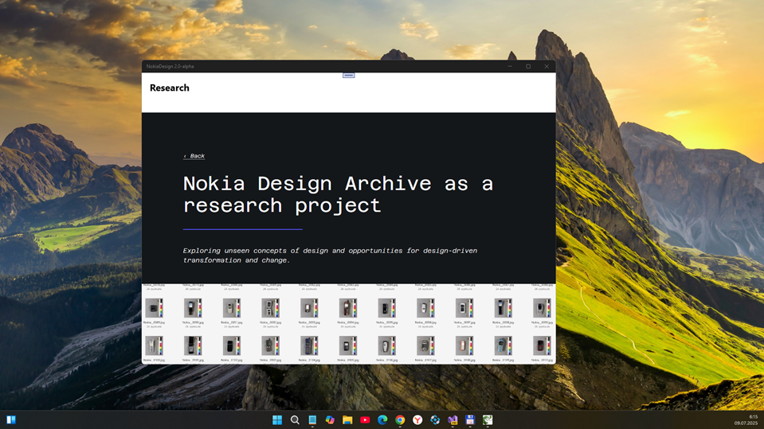
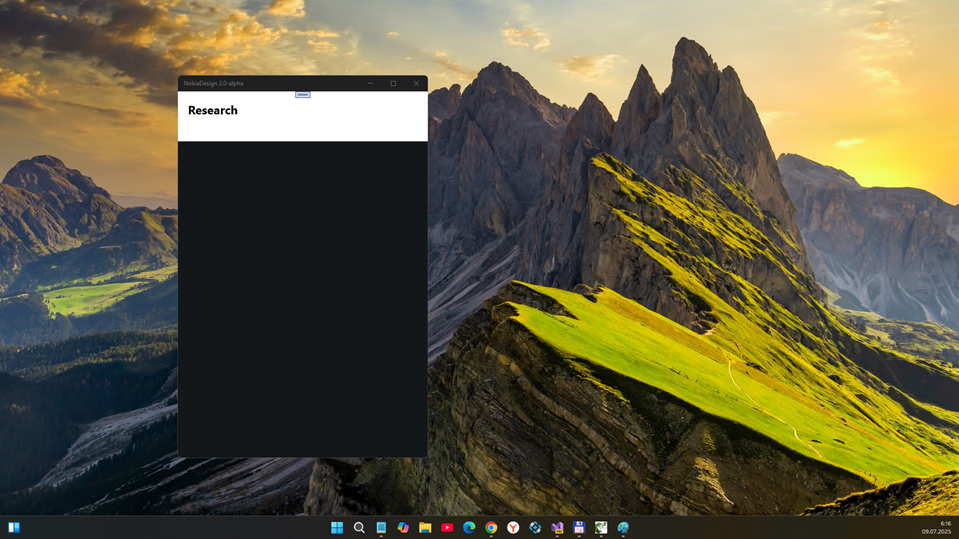

# NokiaDesign 2.0-alpha :: main branch

## Preface
I decided to do some micro-research of ultra-fast ai dev some simplest UWP app for Nokia Design Archive project.

I used WindSurf AI IDE based on VS Code. This IDE includes cuul ai agents such as ChatGPT 4.1. So, I opened WindSurf, then started my "ai tango" with words: "Hi. Please develop a prototype of the NokiaDesign UWP application with site parsing. https://nokiadesignarchive.aalto.fi/. The application may be compatible with WinSDK 14393 for use under a WinDows10Mobile flashback. It is advisable to implement some kind of futuristic menu (based on some cool control that needs to be searched on the Internet). Suggested sections about me: Information, Research, Network, Chronology"

## Screenshot

## Status
- Simplest UWP app (sketch) was constructed above 5 minutes. See Wiki for details.
- Manual improving of Sections (only 10-20 minutes) . Not ideal, 100500 parsing errors ))

## Biggest bugs
- On W10M, Research Section unreadable ("black screen")
- Projects Parsing broken

## Conclusion
AI automatically choosed C# language and constructed UWP sketch for me. Simple and sample :) I recommend it =)

## References
-  https://nokiadesignarchive.aalto.fi Nokia Design Archive site
-  https://windsurf.com "My second pilot today" (ai coding automation tool) 

## :: ::
AS IS. No support. Developers / Geeks only. "DIY mode"

## ::
[m][e] July, 09 2025

